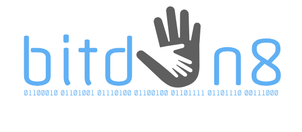
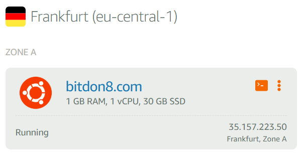

<p align="center">
  
</p>

# BitDon8.com - About

BitDon8 is a platform to donate with CPU power and blockchain technology. You can decide for whom to mine Monero (XMR). Monero is an open-source cryptocurrency created in April 2014 that focuses on privacy and decentralization. While you are surfing on the Internet, just open bitdon8.com and hit the start button on any organizations page. After that BitDon8 manages the rest of the work.

## How it works

BitDon8 builds up connections to XMRPOOL via our special Websocket And Stratum Proxy. The Microservices run in Docker containers and orchestrated by Kubernetes cluster. Each and every organization have their own Monero wallet, where they collect virtual money. They can use it for good purpose. Our Twitter service creates a tweet every day with the results of the day.

## Install 

```bash
sudo apt-get update && apt-get upgrade -y
sudo apt install docker.io
curl -Lo minikube https://storage.googleapis.com/minikube/releases/latest/minikube-darwin-amd64 && chmod +x minikube && sudo mv minikube /usr/local/bin
sudo minikube start --vm-driver=none
git clone https://github.com/bitdon8/bitdon8-core.git
cd /home/user/bitdon8-core/node1
docker build -t bitdon8-web .
kubectl run bitdon8-web --image=bitdon8-web --port 80
kubectl expose deployment bitdon8-web --type=LoadBalancer
cd ../
docker build -t bitdon8-proxy .
kubectl run bitdon8-proxy --image=bitdon8-proxy --port 8888
kubectl expose deployment bitdon8-proxy --type=LoadBalancer
```
## VPS in Amazon Web Services

This project is based on AWS' Lightsail service:

<p align="center">
  
</p>

## Support This Project

If you do so, consider a one time donation:

* Monero: `4AnqK9CTbTuJZjeNRjiEJ6dxqWy3RQRzmiNtvFk1n7RMCfSA4dJ2t7pY43oXbtCZSQex2uqvmqbqFS4CCGjByEwwJ7LJuns`

## Thanks / Credit

* The Web and Stratum proxy is based on the work done by trey-jones (https://github.com/trey-jones/xmrwasp).
* Bitdon8.com version is created and currently maintained by n0rb (norb.puts(at)gmail.com)
